<div align="center">

  

  # KRINTROX
  
  
  
  <br/>

  [](https://discord.gg/YOUR_INVITE_LINK)
  [](https://github.com/krintrox)
  [](https://krintrox.dev)
  [](https://visitorbadge.io)

</div>

<br/>


##  About Us


Welcome to **Krintrox**. We are a forward-thinking collective of developers and data scientists bridging the gap between modern web applications and artificial intelligence.

<br/>

```python
class Krintrox:
    def __init__(self):
        self.name = "Krintrox"
        self.role = "Tech Collective"
        self.domains = ["AI/ML", "Data Science", "Web Dev"]
        self.motto = "Engineer the Future"
    
    def say_hello(self):
        print("From full-stack solutions to predictive")
        print("modeling, we engineer the future.")

me = Krintrox()
me.say_hello()
```

<br clear="both"/>


##  Technology Arsenal

<div align="center">

### 🌐 Web Development
<p>
  
  
  
  
  
  
</p>

### 🧠 AI & Machine Learning
<p>
  
  
  
  
  
</p>

### 📊 Data Science
<p>
  
  
  
  
  
</p>

### ☁️ Cloud & DevOps
<p>
  
  
  
  
</p>

</div>


## 🔭 Current Focus

<table>
  <tr>
    <td width="50%" valign="top">
      <h3 align="center">🧠 Artificial Intelligence</h3>
      <p align="center">
        Developing neural networks, transformer models, and cutting-edge deep learning architectures for real-world applications.
      </p>
      <p align="center">
        
        
      </p>
    </td>
    <td width="50%" valign="top">
      <h3 align="center">📊 Data Science</h3>
      <p align="center">
        Advanced data analytics, interactive visualizations, and predictive algorithms that drive business intelligence.
      </p>
      <p align="center">
        
        
      </p>
    </td>
  </tr>
  <tr>
    <td width="50%" valign="top">
      <h3 align="center">🌐 Modern Web</h3>
      <p align="center">
        Building responsive, AI-integrated web applications with seamless user experiences and blazing-fast performance.
      </p>
      <p align="center">
        
        
      </p>
    </td>
    <td width="50%" valign="top">
      <h3 align="center">🔐 Security & Privacy</h3>
      <p align="center">
        Implementing robust security measures and privacy-preserving techniques in all our AI and web solutions.
      </p>
      <p align="center">
        
        
      </p>
    </td>
  </tr>
</table>


## 🤝 Contribute

<div align="center">

We are always looking for collaborators to help us push the boundaries of what's possible.

```mermaid
graph LR
    A[🍴 Fork] --> B[🌿 Branch]
    B --> C[✨ Code]
    C --> D[📝 Commit]
    D --> E[🚀 Push]
    E --> F[🔀 PR]
    F --> G[🎉 Merge]
    
    style A fill:#6366F1,stroke:#4F46E5,color:#fff
    style B fill:#8B5CF6,stroke:#7C3AED,color:#fff
    style C fill:#EC4899,stroke:#DB2777,color:#fff
    style D fill:#F59E0B,stroke:#D97706,color:#fff
    style E fill:#10B981,stroke:#059669,color:#fff
    style F fill:#3B82F6,stroke:#2563EB,color:#fff
    style G fill:#22C55E,stroke:#16A34A,color:#fff
```



</div>

<details>
<summary><b>📋 Contribution Steps (Click to expand)</b></summary>

<br/>

| Step | Command | Description |
|:---:|:---|:---|
| 1️⃣ | `Fork the Project` | Create your own copy of the repository |
| 2️⃣ | `git checkout -b feature/NewModel` | Create your Feature Branch |
| 3️⃣ | `git commit -m 'Optimize training loop'` | Commit your Changes |
| 4️⃣ | `git push origin feature/NewModel` | Push to the Branch |
| 5️⃣ | `Open a Pull Request` | Submit for review |

</details>


## 📬 Connect With Us

<div align="center">
  <a href="https://discord.gg/YOUR_INVITE_LINK">
    
  </a>
  <a href="https://twitter.com/krintrox">
    
  </a>
  <a href="https://linkedin.com/company/krintrox">
    
  </a>
  <a href="mailto:contact@krintrox.dev">
    
  </a>
  <a href="https://krintrox.dev">
    
  </a>
</div>

<br/>

<div align="center">
  
</div>
